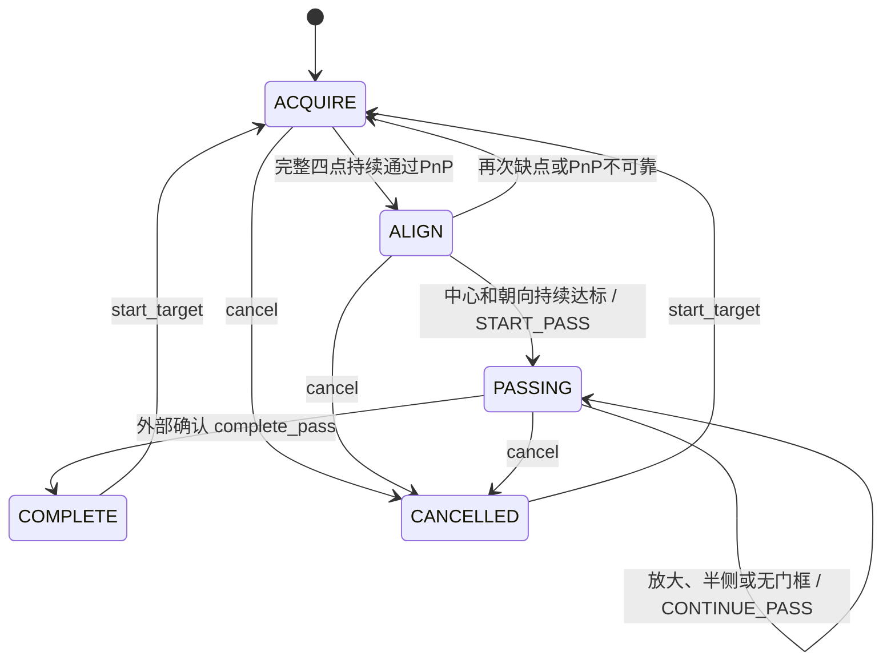

# 门框视野恢复、对准与过门决策

本模块接收 YOLO Pose 结果并输出行为，**不执行机器人运动**。原有 PnP 求解器保持无状态；每个当前任务使用一个持续存在的 `GateGuidance` 对象。

## 阶段规则



对准阶段的锁定可以撤销。开始前进过门后的锁定只有外部完成、取消或开始新目标才解除。**PnP 成功不等于对准，也不等于已通过门框。**

| 阶段/观察 | 行为 |
|---|---|
| 找门：TL、BL 有，TR、BR 无 | `TURN_RIGHT` |
| 找门：TR、BR 有，TL、BL 无 | `TURN_LEFT` |
| 找门：框高≥90%，上、下边缘均贴近图像边界 | `BACKWARD`，优先于半侧转向 |
| 找门：四点齐全且 PnP 可靠，但稳定时间尚不足 | `HOLD`，累计稳定识别 |
| 找门：单点、对角点、其他部分组合 | `HOLD`，不猜测缺失点 |
| 找门：有效图像持续无可靠门框 | `SCAN`，低速先右扫，再左右交替 |
| 对准：新的可靠 PnP 可用 | `ALIGN_TO_GATE`，提供中心和朝向误差 |
| 对准：丢点或 PnP 不可靠 | 回到找门流程，允许重新转向、后退或搜索 |
| 对准持续达标 | 一次 `START_PASS`，进入 `PASSING` |
| 前进过门：有效图像中门框放大、裁切、半侧或消失 | `CONTINUE_PASS`，不再补视野 |
| 任一活动阶段：没收到新帧、过期、倒序、结构错误、多目标未选择 | `HOLD`，保留阶段、清除连续计数 |
| 已完成或取消 | `HOLD`，直到明确开始下一目标 |

角点可见要求：置信度≥0.5、坐标有限且位于图像内。低置信度、图外或非有限坐标代表该点不可用；缺少整个置信度字段、数组形状不对、非法置信度或边框则是输入错误。没有可靠检测框（分数低于原 PnP 的检测阈值）按无可靠目标处理。

“框高很大且上下贴边”只是基于检测框的近距离裁切判据，不是水下距离测量。只有缺点而没有上下贴边证据时，不触发后退。模型预测点的高置信度也不能代替实际训练质量验证。

## 无模型时检查

在交付目录执行：

```powershell
python -m gate_pnp --guidance
python -m unittest discover -s tests -v
```

第一条返回 `ACQUIRE / HOLD`，没有模拟门框、没有旧姿态和运动输出。仍可用 `python -m gate_pnp` 检查原 PnP 入口，返回 `NO_INPUT`。

## 未来接入 YOLO Pose

初始化一次，**不要每帧重新创建决策器**：

```python
from pathlib import Path
import time
from gate_pnp import (
    GateGuidance, GuidanceConfig, PnPConfig, geometry_from_files,
    extract_gate_observations, select_gate_observation,
)

root = Path.cwd()  # 在交付目录运行，集成时改成实际配置目录
geometry = geometry_from_files(root / "config/front_camera.yaml", root / "config/vision.yaml")
pnp_config = PnPConfig.from_file(root / "config/pnp.json")
guidance_config = GuidanceConfig.from_file(root / "config/guidance.json")
guidance = GateGuidance(geometry, guidance_config, pnp_config)
guidance.start_target("gate-1")
```

在现有采集/推理程序中，将每一帧结果传入下面的接入函数。`captured_at` 必须在采集时用 `time.monotonic()` 记录，不能在推理结束后重新生成。`frame_id` 是递增整数；同一张图片重复推理仍是同一帧，不可重复累计稳定时间。

```python
def on_yolo_result(result, frame_id, captured_at, selected_detection_index=None):
    observations = extract_gate_observations(
        result, geometry, pnp_config,
        frame_id=frame_id,
        timestamp=captured_at,
        target_id=guidance.target_id,
    )
    selected = select_gate_observation(observations, selected_detection_index)
    return guidance.update(selected, now=time.monotonic())

# result 是未来 model.predict(...) 返回列表中的单个 Results 对象。
# 接收决策后，由你的运动控制程序处理 decision.action。
# 这里不加载权重、不读取图片、不执行运动。
```

所有输入仍对应**1280×720 → alpha=0 去畸变 → 直接缩放为640×640**的原附件流水线。不要二次去畸变、再次还原 YOLO 内部缩放或传入 `xyn`。内参及版本要求见主 README。

一帧中只有一个门框时可不指定索引；存在多个候选时必须指定当前帧原始检测索引，否则输出等待。选择错误目标索引时也不会偷偷回退到另一道门。选择空列表属于调用错误，抛出 `ValueError`；提取器正常返回至少一个观察，故直接对其返回值调用选择器不会遇到空列表。

`target_index` 只表示当前帧中的位置，**不是跟踪编号**。`target_id` 表示外部管理的当前门框任务。调用方必须持续选择同一道物理门；确实换门时调用 `start_target("gate-2")`，清除旧阶段与计数。模块不包含目标跟踪或自动换门。

未收到图像/推理结果时使用 `guidance.update(None, now=time.monotonic())`；提取器接收到 `result=None` 也产生输入错误，最终返回 HOLD。只有结构完整的有效结果中没有门框，才累计扫描时间。损坏的非门框检测同样不能伪装成无门框。

## 输出字段

`GuidanceDecision` 包含：

- `phase`、`action`、`reason`：当前阶段、决策及原因。
- `target_id`、`target_index`、`frame_id`、`timestamp`：目标周期与当前帧身份。
- `visible_points`：当前有效关键点名称。
- `pnp_result`：本帧执行 PnP 时的结果，其他情况为空；从不复用旧帧位姿。
- `alignment_error`：可靠姿态下的对准误差，其他情况为空。
- `scan_direction`、`speed_profile`：仅 SCAN 时给出 LEFT/RIGHT 和 SLOW。

对准误差定义：

| 字段 | 含义 |
|---|---|
| `horizontal_m` | 相机在门框坐标系中的 X 坐标，即中心水平偏差 |
| `vertical_m` | 相机在门框坐标系中的 Y 坐标，即中心竖直偏差 |
| `optical_axis_gate` | 相机光轴在门框坐标中的单位方向 |
| `optical_axis_error_deg` | 光轴与门框正面穿越方向 +Z 的夹角 |
| `desired_offset_gate_xy_m` | 门框坐标系中的目标位移 `[-horizontal, -vertical]` |

这不是推进器命令，也不是机体速度。对准使用相机中心和光轴；不约束光轴周围的滚转，不指定纵向距离或后退目标。机体中心、相机安装外参、滚转适航要求、运动速度与轴方向由外部控制层处理。

结果支持 `decision.to_dict()` 及 JSON 序列化。输入错误时不回显不合法的帧字段。过门阶段输入故障会 HOLD，但阶段仍为 PASSING；恢复有效帧后继续 CONTINUE_PASS，不退回找门。

外部控制层明确确认通过后调用 `guidance.complete_pass()`；仅在 PASSING 阶段允许该调用。取消任务用 `guidance.cancel()`。开始下一道门用 `guidance.start_target("gate-2")`。门框消失不会自动调用完成。

## 默认配置

所有阈值位于 `config/guidance.json`，是**待真实水下数据调优的工程默认值**，与原有 PnP 质量参数分开：

| 参数 | 默认值 |
|---|---|
| 可见点置信度 | 0.5 |
| 过大检测框高比例 / 上下边界容差 | 90% / 各2%图像高度 |
| 转向或后退确认 | 连续0.2秒且至少3个不同帧 |
| 无可靠门框确认 | 连续0.5秒 |
| 扫描方向切换 | 每3秒，先右后左 |
| 完整四点 PnP 稳定确认 | 连续0.3秒且至少3帧 |
| 水平、竖直对准容差 | 分别3 cm |
| 光轴朝向容差 | 5° |
| 对准稳定确认 | 连续0.5秒且至少5帧 |
| 最大帧龄 | 0.5秒 |
| 连续采集帧最大间隔 | 0.25秒 |

时长从条件首次出现的采集时间起算；状态条件改变、中断或拒绝帧会清除累计。间隔过长的下一张有效帧重新开始计数。过期、未来时间、倒序和重复帧返回 HOLD。条件连续达标需要同时满足秒数和帧数，不能靠重复同一帧凑数。

## 验证边界

自动测试使用合成投影和符合 Ultralytics 结构的测试结果对象，覆盖识别、对准、恢复、过门锁定、帧时序和输入故障。`verification.json` 和 `test-results.txt` 记录本次完整实跑结果。

没有加载真实模型，没有连接机器人，没有验证推进器动作、实机对准或真实穿门成功率。示例中的动作名称表示待控制程序执行的决策，不代表机器人已经运动。
